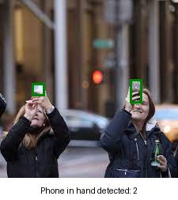
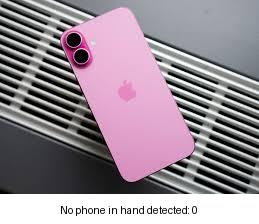

# Phone in Hand Detection - Streamlit App

This project allows you to detect if a person is using a phone by analyzing images using the YOLOv8 model. It uses a Streamlit interface where you can upload images and view detection results instantly.

## Features

- Phone-in-hand detection using YOLOv8 (more accurate `yolov8m.pt` model)
- Clean UI with bounding boxes and labels
- Result displayed with a white caption bar below each image

## How it Works

- Upload one or more images via the Streamlit interface
- Each image is processed using YOLOv8
- If a phone is detected **in a person’s hand**, a green bounding box is drawn and the count is displayed
- If no phone is detected, a message shows "No phone detected: 0"

## Examples

### ✅ Phone in Hand Detected (Success)

> In this image, the model detected a phone **in hand**. A green box is drawn around it.

---

### ⚠️ Phone Present but Not in Hand (No Detection)

> Here, a phone is visible, but it’s **not being held** — hence, **no detection** as per model's logic.

